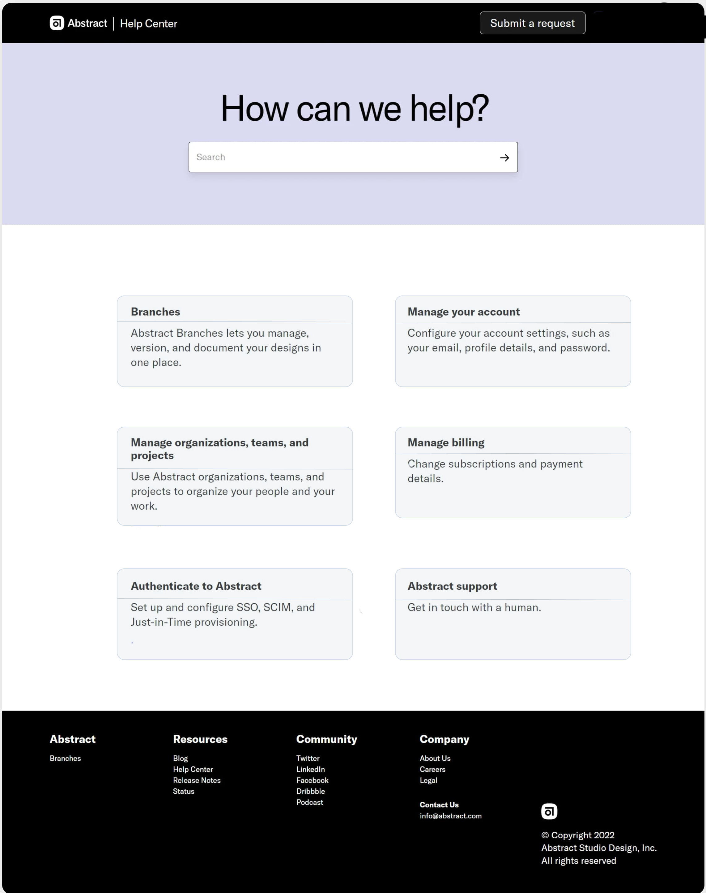

## React Assignment

1. How can you implement shared functionality across a component tree?
Ans: Implement shared functionality across a component tree by using React Context. React Context allows you to create a context object that holds shared data or functions. Components can then access this context from anywhere in the tree without needing to pass props down manually through each level.

2. Why is the `useState` hook appropriate for handling state in a complex component?
Ans: The useState hook is appropriate for handling state in a complex component because it allows you to manage and update state directly within a functional component. It's simple to use, and it lets you create multiple pieces of state for different parts of your component. This makes it easy to keep your code organized and maintainable, even as the component's logic becomes more complex.

3. Design a user interface resembling the provided page. Fetch the data from the server and dynamically map the information cards to the fetched data. Ensure that the search functionality is also implemented.



### Project Objective

This is a Help Center API project developed using TypeScript, Express.js and Object Data Modeling (ODM) and Validation Library Mongoose for MongoDB. The API allows users to manage Help Center cards, including creating, retrieving, and organizing different sections such as "Branches," "Manage Your Account," and "Manage Billing." The project emphasizes proper error handling, scalable architecture, and efficient data management.

#### Setup

1. Clone the repo

2. Go to frontend directory:
```bash
   cd Frontend
   ```

3. Install Dependencies:

```bash
npm install
# or
yarn install
```

4. Run the development server:

```bash
npm run dev
# or
yarn dev
```